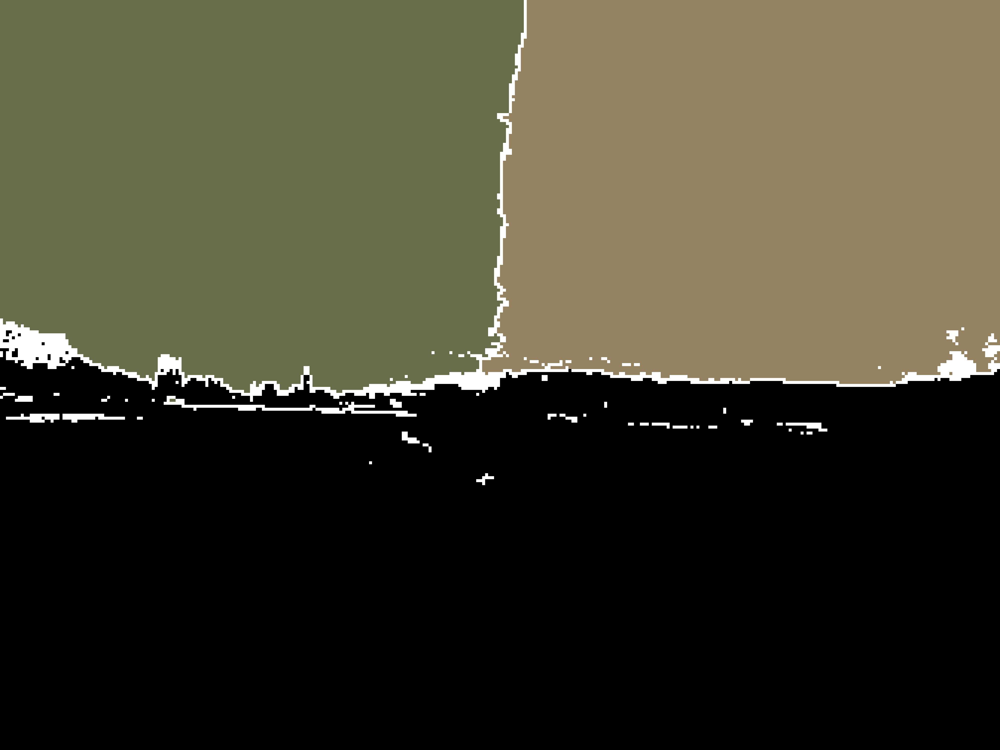

# Image Compression Algorithm 🦭

A new lossless image compression algorithm.

In the newest version the algorithm performs rather good, but manages to surpass PNG only in about 25%.

Here are the file sizes of the original images (optipng) and the sizes of the compressed image (with the algorithm). The size on larger volumes may be different.

| File name | File size (optimized PNG) in Byte | File size (image-compressor) in Byte |
|-----------|-----------------------------------|--------------------------------------|
| img_1     | 12,537,083                        | 12,847,145                           |
| img_2     | 10,791,729                        | 10,062,265                           |
| img_3     | 00,001,574                        | 00,001,781                           |
| img_4     | 14,076,373                        | 18,827,534                           |

## Using the Algorithm
### Using the binaries
Binaries are provided. They can be found at the releases or at the buttons at the beginning of this readme.

### Compiling from source
The algorithm can be compiled from source on Windows / Mac OS / Linux without any external dependencies outside Rust.
1. Clone this repository:
   
    `git clone https://github.com/umgefahren/image-comp-lib-rust/`
2. Compile the source code
    
    a) Make sure you have rustup installed. If not  install it: [rustup](https://rustup.rs)
    
    b) Compile:
    
    `cargo build --release`
    
    The resulting binary can be found at `./target/release/image-compressor`
    
    Compiling with the `--release` flag is not required but highly recommended. Otherwise the compression will take ages.

### How to use the shipped binariers

One should execute the binary with the arguments provided.
1. The first argument specifies the behavior. Pass `comp` for compression. Pass `dec` for decompression. 
2. The second argument is the input files Path.
3. The third argument is the output files Path.

If `-h` or `--help` is passed it will give you the same instructions.

The algorithm only supports 8-Bit RGB at the moment. It should be able to compress every common image format (f.e. PNG, JPEG). But it makes no sense to compress a lossy image like a JPEG.

## How the system works
### Clustering

The first step in the system is clustering the pixels. This happens in 5 Dimensions, with R, G, B, x and y of every Pixel. X & Y are normed over 255 in order to have a balance between the color values and the pixel position. This might offer a possible improvement.

In the current settings a [Kmeans](https://en.wikipedia.org/wiki/K-means_clustering) is used to define 3 dominant clusters. More clusters are possible, but the calculation time increases rapidly with an increasing number of clusters. The encoding supports up to 255 clusters, but this is probably overkill.

After defining the clusters, we calculate a cluster map, that removes the color values and just displays belonging to a cluster. A visualization of this would look like this:

### Grid

In the next step we lay a grid on top of the cluster map. The chunks of the grids are not fixed size. They vary in size near the edges. For every grid, we check if all pixels in a grid belong to the same cluster. If this is given, the pixel is calculated relative, otherwise absolute. The grid contains for every chunk a value that determines the cluster or that the chunk has to be calculated absolute. Here is an illustration of this grid map. Every white pixel, symbolizes an absolute chunk.

This maybe a better illustration. Every white pixel, symbolizes a grid with absolute values. The three colors are the minimum values of each cluster, from that value every pixel value is calculated.

### Calculating Lists

In this step, we finally calculate the pixel values that are later written into the file. Every chunk is calculated according to the grid's perception of absolute or relative value. Every chucks pixel values are added to a super list of relative or absolute pixel values. The pixel values are calculated in wiggly lines. Every cluster has a minimum pixel value. This value is according to the minimum R, G, B value in that chunk. The resulting pixel value is an addition of this chunk value and the encoded pixel value.

### Flatten and Byte conversion

The grid, the cluster colors, the lines are converted in Vectors of u8 and then converted into bytes.

### ~~Deflate~~ Zstd

Grid and lines bytes representations are compressed with the ~~deflate~~ Zstd algorithm. This should achieve the compression and provides an opportunity to optimization.

### Write File

The resulting binary is just a list of the relevant compressed objects.

## Advantages compared to PNG

Because of the grid, it's possible to load just specific chunks without loading the entire image, but this is not implemented yet. With further improvements it might be possible to surpass PNG in compression rate, but I can&#39;t prove that.

## Disadvantages compared to PNG

Because of the clusterisation it takes quite long to calculate a result. It might be possible to improve that, although this would probably require to abolish Kmeans for another clustering algorithm. One solution to that could be a neuronal net.

## Contribute
E-Mail me at hannes.furmans@web.de

## DISCLAIMER
As you can see, I'm not a computer scientist and not a very skilled programmer. I'm just a student taking careful steps in the world of computer science.

## Detailed test results

Using [this](http://imagecompression.info/test_images/rgb8bit.zip) Dataset i achieved the following results:
The hole folder with all the compressed images is 305,598,693 Bytes in size. It took 405.28 Seconds to compress them. It took 9.86 Seconds to decompress them. My compression ratio is 1.54 on the hole image set.

| Image                  | Compression Ratio (image compression algorithm) | Compression Ration (PNG) |
|------------------------|-------------------------------------------------|--------------------------|
| spider_web.ppm         | 2.14235671557331                                | 3.8174019821404537       |
| deer.ppm               | 1.2424318516015507                              | 1.5100885950658829       |
| fireworks.ppm          | 3.642381743674327                               | 3.9167099444804947       |
| artificial.ppm         | 12.25476523000428                               | 11.676586675575187       |
| bridge.ppm             | 1.2273064711294759                              | 1.6912692993281646       |
| flower_foveon.ppm      | 2.4469685311217293                              | 3.2993969937563423       |
| big_tree.ppm           | 1.2789847127858722                              | 1.7289463913381014       |
| cathedral.ppm          | 1.5089509013690656                              | 1.94848639952808         |
| hdr.ppm                | 1.9960575653205344                              | 2.8791696311003774       |
| leaves_iso_1600.ppm    | 1.203903570936856                               | 1.5931277540194704       |
| big_building.ppm       | 1.3922857035699863                              | 1.9135150561088072       |
| nightshot_iso_1600.ppm | 1.501047996887146                               | 1.7743906785849834       |
| nightshot_iso_100.ppm  | 2.251600481220427                               | 3.0845039578711773       |
| leaves_iso_200.ppm     | 1.3158267828823695                              | 1.7839604041821022       |
